# Efficient-architecture-development-for-Gaussian-Random-Variable-Based-CV-QKD-on-FPGA-
Efficient FPGA-based architecture for Gaussian Random Variables in Continuous Variable Quantum Key Distribution (CVQKD). The design focuses on secure quantum communication with optimized resource utilization, high-speed processing, and accurate Gaussian random number generation for cryptographic applications.
## Overview
This project focuses on developing an efficient FPGA architecture for Gaussian Random Variable generation in Continuous Variable Quantum Key Distribution (CV-QKD) systems for secure communication.
## Technologies Used
- MATLAB
- FPGA
- CV-QKD
- Gaussian Distribution
- Hardware Optimization
## Project Implementation
The system generates Gaussian random variables and applies them in quantum key distribution for secure communication. The architecture is optimized for better speed, reduced power consumption, and efficient hardware utilization.
## MATLAB Code
 
## Result Graphs
### Graph 1
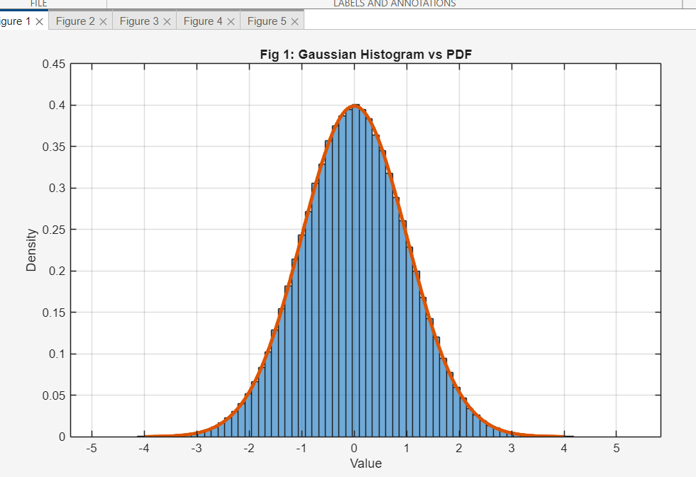
### Graph 2
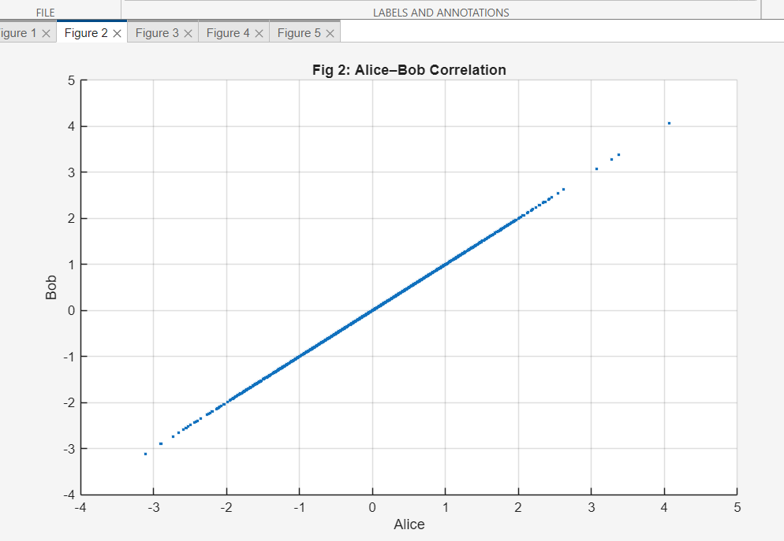
### Graph 3
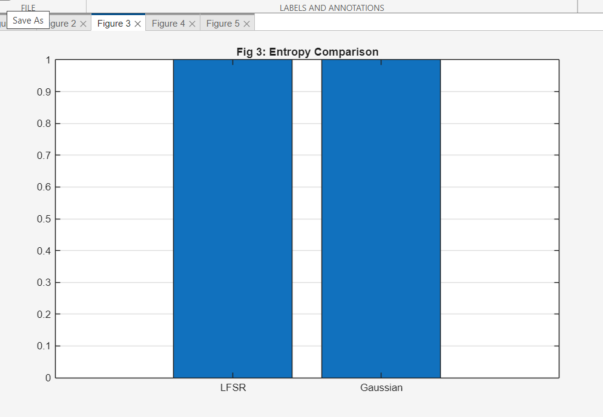
### Graph 4
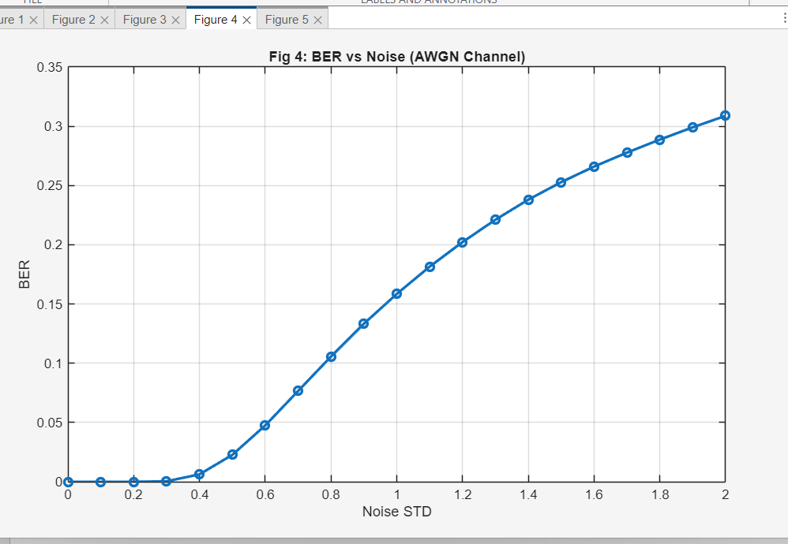
### Graph 5
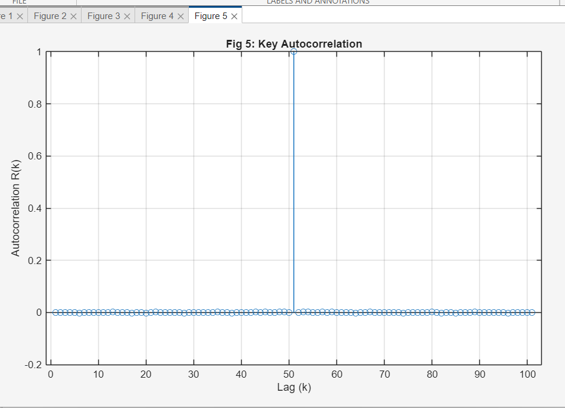
## Schematic Diagram
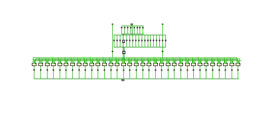
## Simulation Output
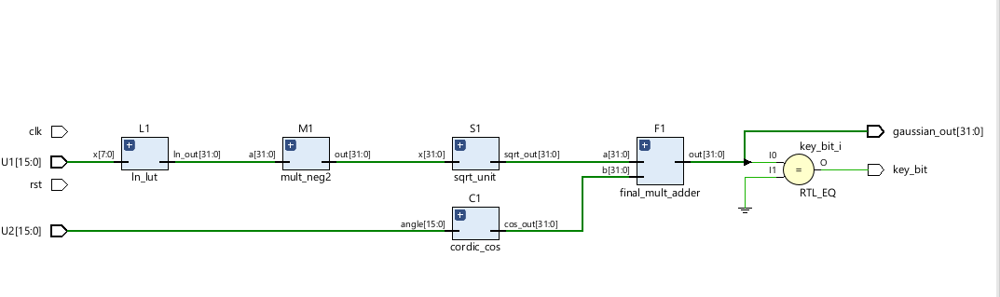
## Power Analysis
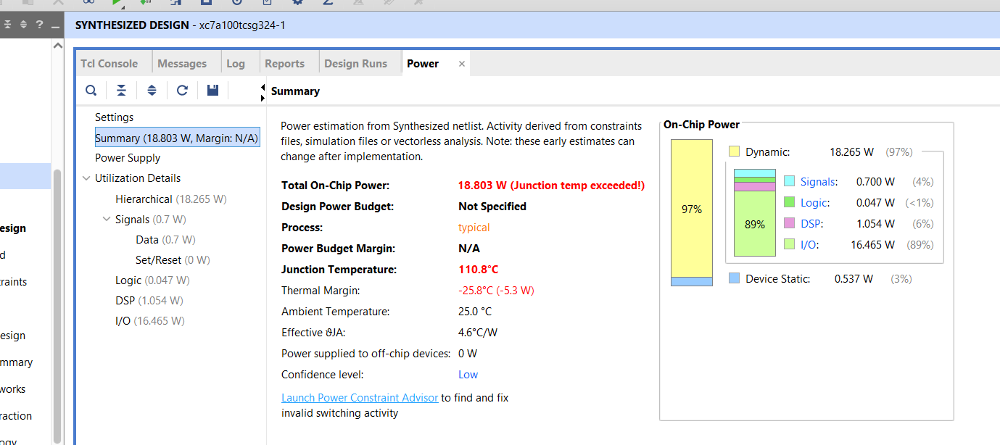
## Gaussian Wave Output
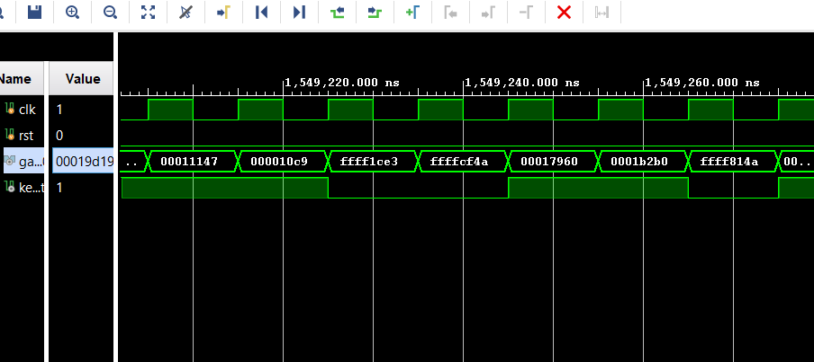
## Performance Analysis
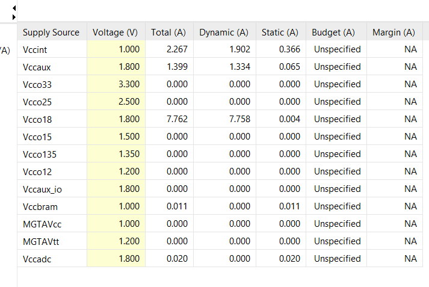
## Application Graphs
### Application Graph 1

### Application Graph 2
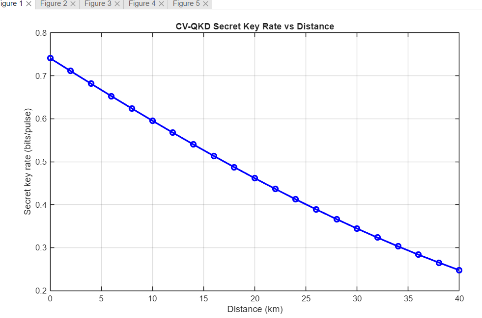
### Application Graph 3
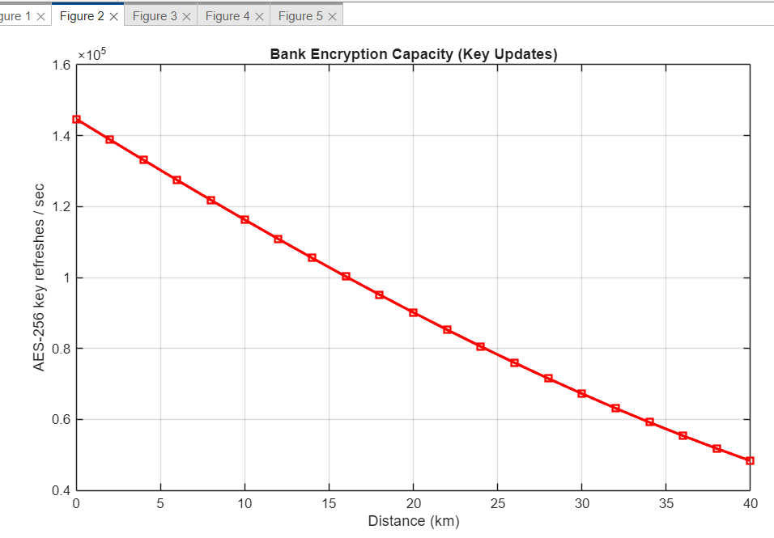
### Application Graph 4
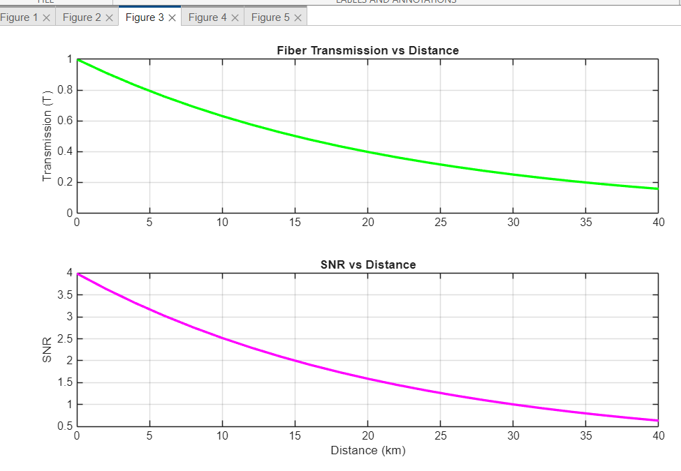
### Application Graph 5
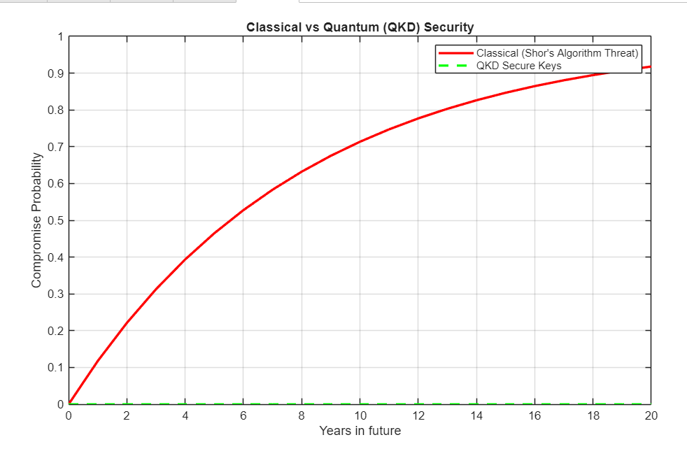
## Applications
- Quantum Cryptography  
- Secure Communication  
- Data Protection  
- Defense Systems  
## Future Scope
- Real-time FPGA deployment  
- Enhanced security algorithms  
- Advanced optimization techniques  
## Author
CH.M adhuri
